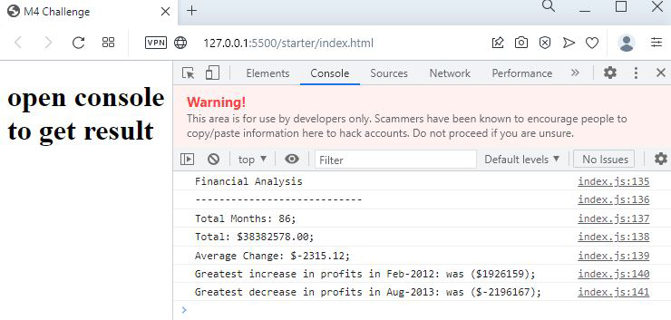

# console-finance
Keep you finance record safe
#Description

This is a straightforward demonstration of the financial calculation concept.
This includes HTML and Java Script connected to display the financial calculations 
on the specified data set. Calculations are made to determine the date, the number of 
months, the total profit or loss, the average changes, and the biggest increments or decrements.

#index.html

html code linked with Java Script to make java script visible to browser.

#index.js

Java Script code that cover entire logic of program.

#image

Screenshot of display result.

Deployed Link:https://ajinthapa2000.github.io/console-finance/
